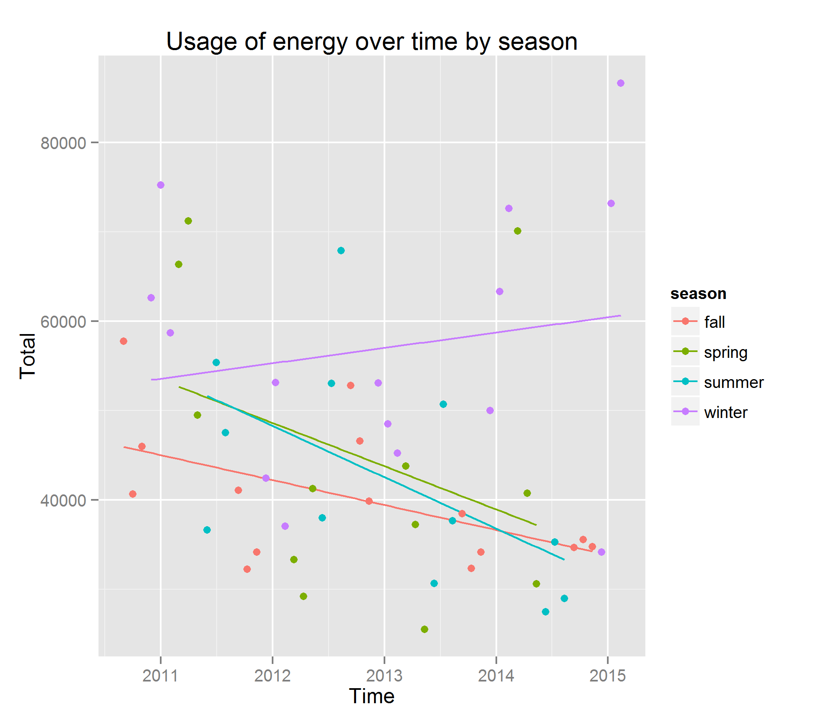
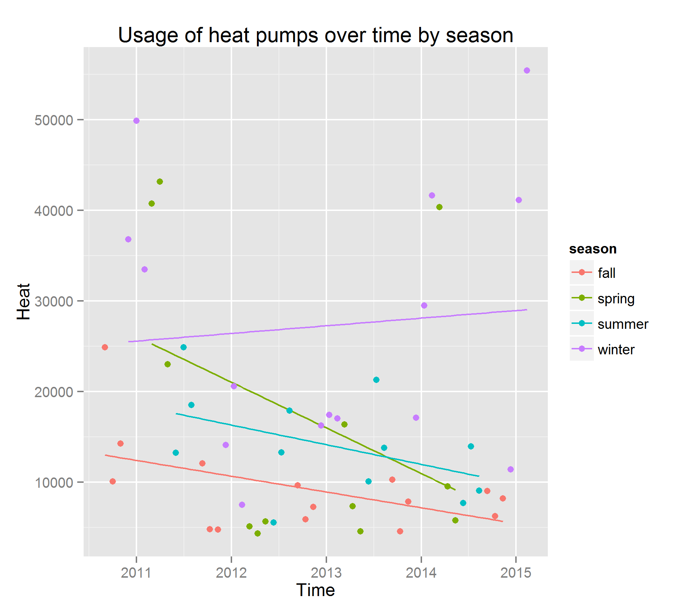
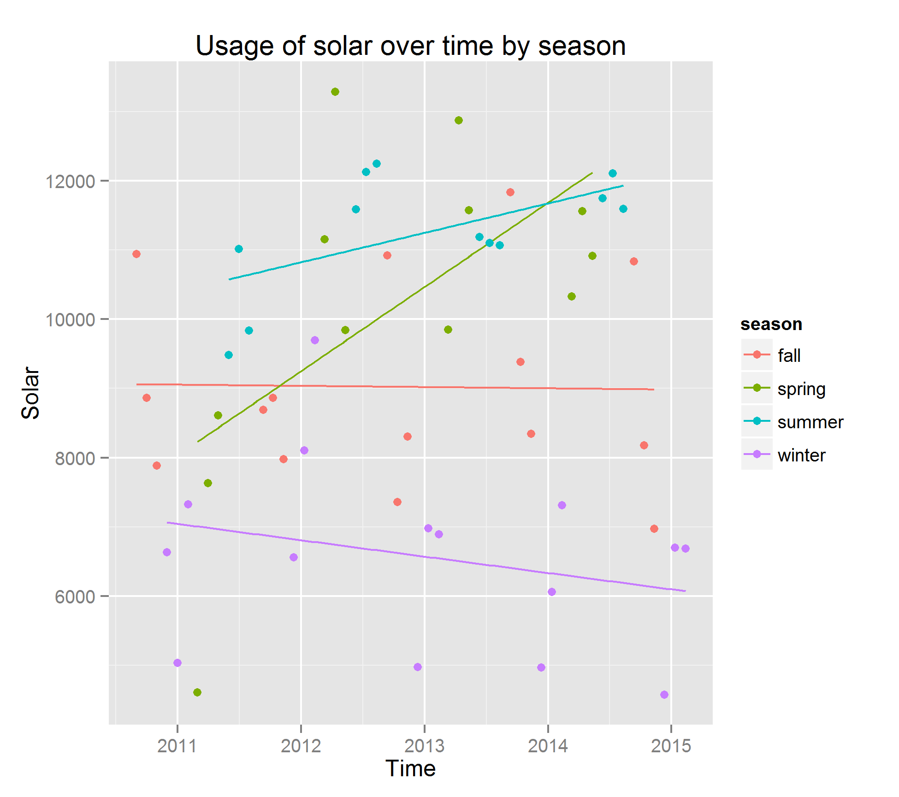
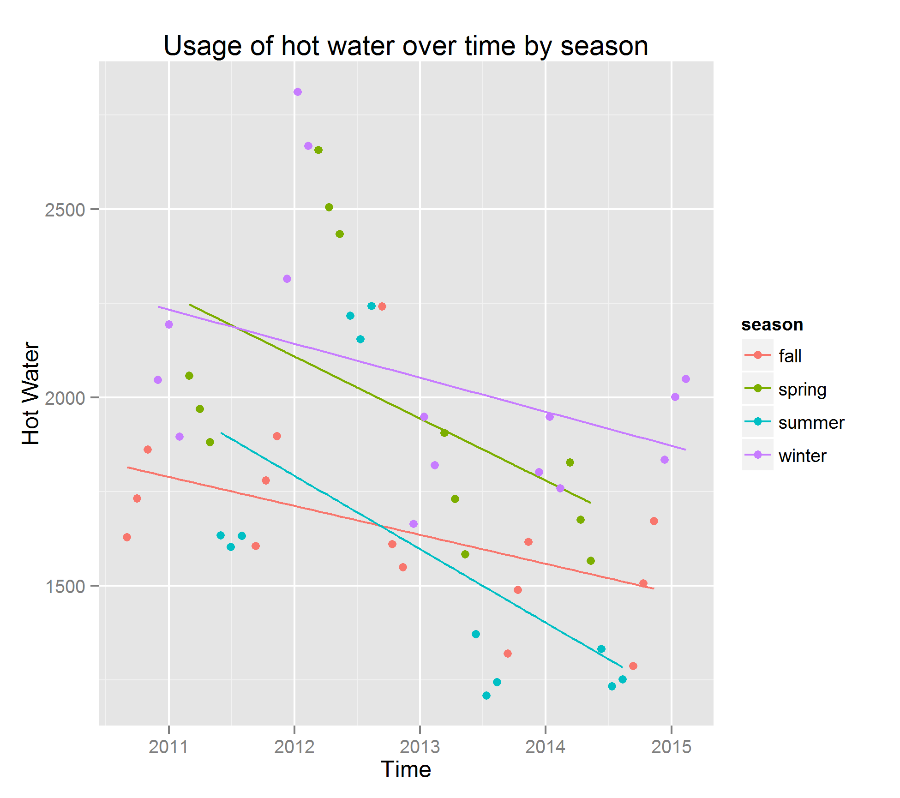
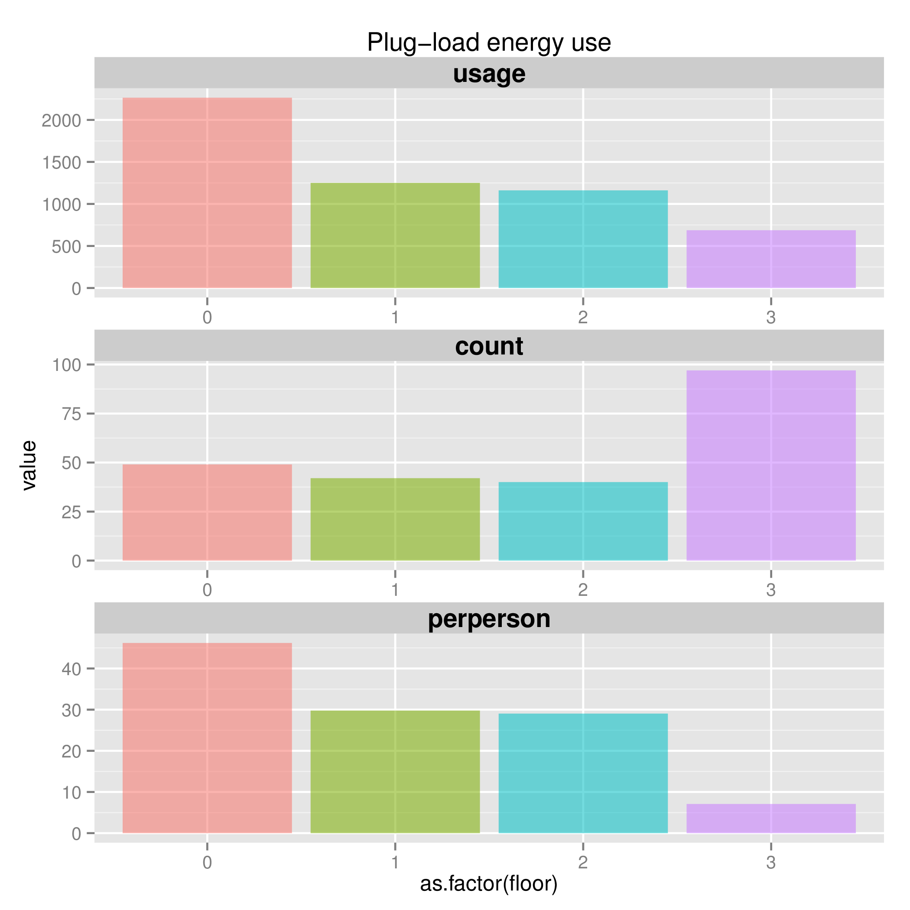
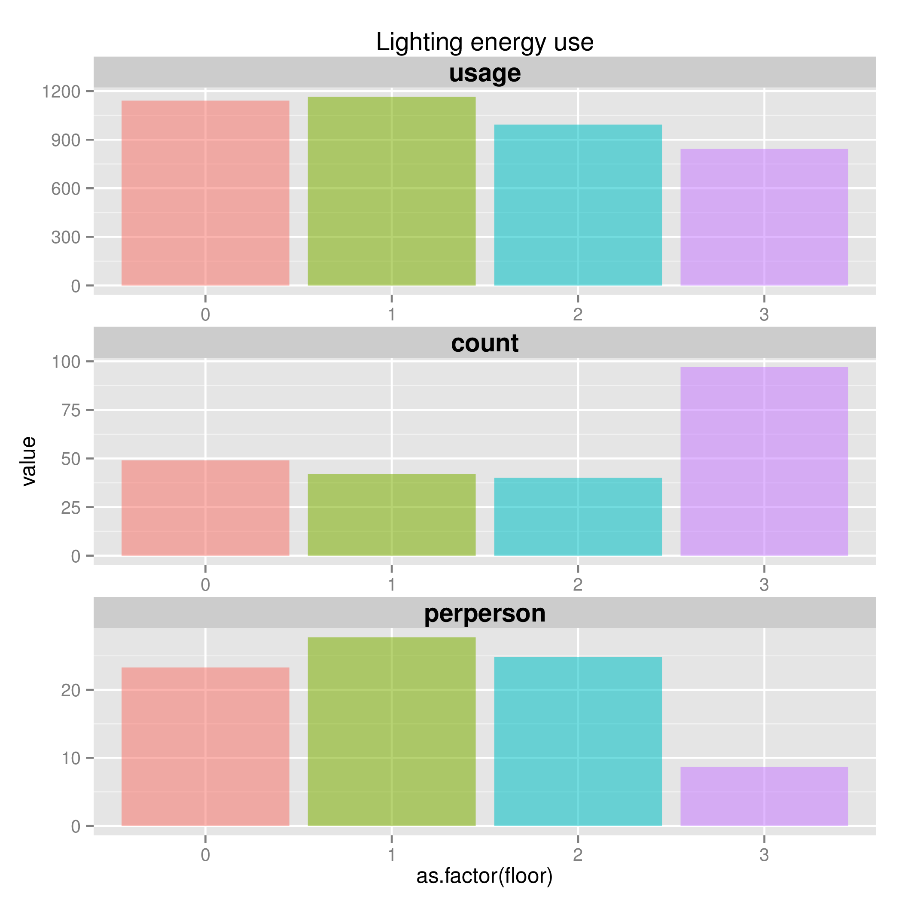
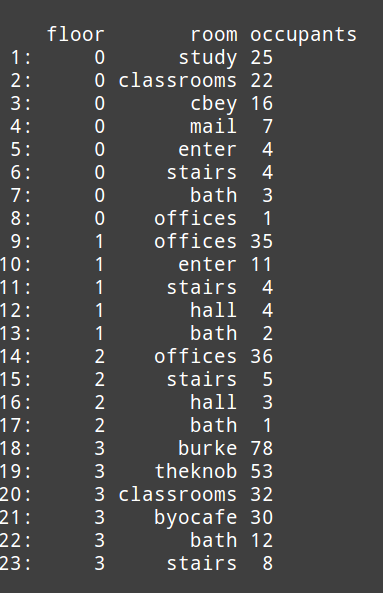
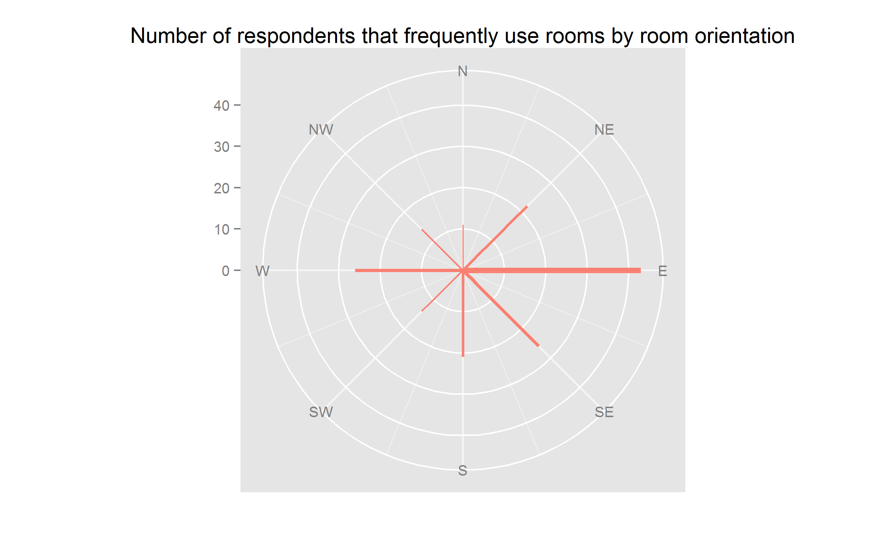

# Introduction

> Kroon Hall is one of the greenest buildings in the US. However, Kroon is using more energy than predicted and not achieving an adequate indoor temperature to make people comfortable.

We received **behavioral survey** and **energy use** data to study how the building is used.

## Our Goals
- Examine patterns of how the building is used across 
    - Seasons
    - Floors
    - Rooms (Based on Survey Data)
    - Type of Usage

## Kroon Hall Fast Facts
- LEEED Platinum - Top 15% Building in Greenness
- 57,000 Square Feet across 4 Floors
- Temp always 68 - 75 F
- Usage in kWh (18 cents) - _2011_

# Act 1: Raw Energy Data!
Plotting the data + running regressions

## Breakdown by Heat and Water

<!--  -->

## Interlude: Cleaning the Behavioral Data
    - Cleaning It
    - Discuss different things to explore
    - Brainstorm
        - Study how people use the rooms
        - Realized there'd be overcounting if we just went by the room counts
    - Created new floor variable

# Act 2: Combining with Behavioral Data
## Plug Usage by Floor

## Lighting Usage by Floor

## Room Usage Table

## People by Room Orientation

## Finale: Tableau Dashboards
- Cut to desktop for privacy

# Things We Learned
## Technology things we learned
- Transforming data to play nicely with Tableau
- First time using GGPlot (Plotting) and GGVis (Interactivity)
- Using polar charts to map behavioral data to spatial data
- New commands for data cleaning

## Possible Recommendations - Student Floors vs Office Floors
- Consolidate people on top or bottom floors to save on heating costs?
- Working with Plugload and Lighting has a relatively small impact
- Be willing to be colder in the winter?
- Encourage studying in auditorium when no lectures?

# Thank You!

- Isabel
- Lucia
- Hugo
- Cameron Yick